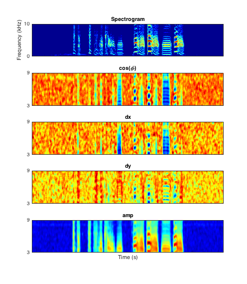

Usage
=====

.. hint:: To pass parameters to any function in the toolbox use parameter/value pairs, see examples below.

.. warning:: Many functions in this toolbox are parallel-enabled (i.e. include parfor loops), check the Parallel Preferences in your MATLAB installation to avoid unwanted behavior.

Spectrograms
------------

To generate a spectrogram, use the function :code:`zftftb_pretty_sonogram`, which computes a simple multi-taper spectrogram using the Gaussian and Gaussian derivative windows, if ``audio_data`` contains the mic trace and ``fs`` the sampling rate::

  >>[s,f,t]=zftftb_pretty_sonogram(audio_data,fs,'len',80,'overlap',79.5,'clipping',[-2 2]);
  >>figure();
  >>imagesc(t,f,s);
  >>axis xy;

The :code:`len` and :code:`overlap` parameters set the length and overlap of the STFT to 80 and 79.5 milliseconds, respectively. Clipping sets the lower and upper clip to -2 and 2 (in logn units, this is the default for legacy compatibility, set the option 'units' to 'dB' to work in decibels).  All options given after the first two, the audio data and the sampling rate, are treated as parameter/value pairs.

+------------+----------------------------------------------------------+----------+---------------------+------------+
| Parameter  | Description                                              | Format   | Options             | Default    |
+============+==========================================================+==========+=====================+============+
| overlap    | STFT overlap (ms)                                        | integer  | N/A                 | ``67``     |
+------------+----------------------------------------------------------+----------+---------------------+------------+
| len        | STFT window length (ms)                                  | integer  | N/A                 | ``70``     |
+------------+----------------------------------------------------------+----------+---------------------+------------+
| nfft       | FFT size (samples)                                       | integer  | ``[] auto``         | ``auto``   |
+------------+----------------------------------------------------------+----------+---------------------+------------+
| zeropad    | Zero-pad (samples)                                       | integer  | ``[] none, 0 auto`` | ``[]``     |
+------------+----------------------------------------------------------+----------+---------------------+------------+
| filtering  | High-pass filter corner Fs (5-pole Elliptic)             | float    | ``[] none``         | ``[]``     |
+------------+----------------------------------------------------------+----------+---------------------+------------+
| clipping   | Spectrogram clipping (logn units)                        | 2 floats | N/A                 | ``[-2 2]`` |
+------------+----------------------------------------------------------+----------+---------------------+------------+
| units      | Set spectrogram units                                    | string   | ``ln,db,lin``       | ``ln``     |
+------------+----------------------------------------------------------+----------+---------------------+------------+
| postproc   | Prettify spectrogram (non-linear)                        | string   | ``y,n``             | ``y``      |
+------------+----------------------------------------------------------+----------+---------------------+------------+
| saturation | Image saturation (brightness of image, postproc on only) | float    | ``[0-1]``           | ``.8``     |
+------------+----------------------------------------------------------+----------+---------------------+------------+

Sound clustering
----------------

Sound clustering is performed with ``zftftb_song_clust``, which computes the L1 distance between features computed for a user-defined template, and a set of audio files.  The first option to the script is the directory to process, if no options are given it will process the current directory (pwd) with parameters set to the default. All options after the first, the directory to process, are passed as parameter/value pairs (see examples below). The basic workflow is as follows:  (1) spectral features are computed for all files in a director, (2) the L1 distance between a template and the files is computed, (3) the user selects hits based on the distance measure.  Results for a particular template are stored in a sub-directory of your choice.  You can go back to this directory and re-run any stage of the process without having to recompute the other stages (examples are given below).  It will work with data saved in .mat files (requires a function to point to location of the data and sampling rate), or audio files.  

.. warning:: You may want to use your selection for automatic clustering later, if so set the ``train_classifier`` parameter to ``1`` or ``true``.

#.  To cluster a set of .wav files use the following command.
    ::

      >>zftftb_song_clust;

#.  You should see the following outputs.
    ::

      >>zftftb_song_clust;
      >>Auto detecting file type
      >>File filter:  *.wav
      >>Would you like to go to a (p)revious run or (c)reate a new one?

#.  The file filter will use the first extension it finds in the directory. For example, if the first file in the directory is a .wav file, the script assumes all files to process are .wav files.  This can be overridden through any of the script options detailed below.  If you choose to (c)reate a new run, you will be asked to name the sub-directory to store results in.
#.  After this, you will then need to select an audio file (anywhere on the computer) that contains the template (find a good sample in the ``gif`` directory).  Once the file is selected, you will be presented with a GUI to tell the program exactly where the template is in time.
#.  Finally, you will perform a manual cluster cut on the L1 distances between the template and the data.  Note that the distances have been inverted, so higher numbers indicate a closer match.
    The clustering window should look like this,

    .. figure:: figures/cluster1_markup.png
      :align: center
      :width: 300px

    Typically, you will find features on the X and Y that separate the points in the upper right hand corner effectively and draw a border around them.  To do this, try different features for X and Y until you see something that looks like the above figure.  Then, click on ``Draw cluster (X and Y only)``.  The window should now look like this,

    .. figure:: figures/cluster_draw1.png
      :align: center
      :width: 300px

    Now draw a polygon around the cluster in the upper right hand corner.  At each vertex left-click, when you're done drawing press ``ENTER``. 

    .. image:: figures/cluster_draw2.png
      :width: 20%

    .. image:: figures/cluster_draw3.png
      :width: 20%

    .. image:: figures/cluster_draw4.png
      :width: 20%

    .. image:: figures/cluster_draw5.png
      :width: 20%

    Click on `DONE` to indicate that you're finished drawing.  As in the rightmost figure you'll see the points change colors to reflect your selection.  Now, set ``Cluster selection`` to the cluster that you want. Close the window and the script will extract your selection.

Parameters for ``zftftb_song_clust`` are given below.

+------------------+----------------------------------------------------------------+--------------------+------------------+--------------+
| Parameter        | Description                                                    | Format             | Options          | Default      |
+==================+================================================================+====================+==================+==============+
| colors           | colormap to use for spectrograms                               | string             | MATLAB colormaps | ``hot``      |
+------------------+----------------------------------------------------------------+--------------------+------------------+--------------+
| len              | STFT window length for spectrograms (ms)                       | integer            | N/A              | ``34``       |
+------------------+----------------------------------------------------------------+--------------------+------------------+--------------+
| overlap          | STFT overlap (ms)                                              | integer            | N/A              | ``33``       |
+------------------+----------------------------------------------------------------+--------------------+------------------+--------------+
| disp_band        | STFT frequency range                                           | 2 ints             | N/A              | ``[1 10e3]`` |
+------------------+----------------------------------------------------------------+--------------------+------------------+--------------+
| audio_load       | Anonymous function used for loading audio data from .mat files | anonymous function | N/A              |              |
+------------------+----------------------------------------------------------------+--------------------+------------------+--------------+
| data_load        | Anonymous function used for loading data to align              | anon               | N/A              |              |
+------------------+----------------------------------------------------------------+--------------------+------------------+--------------+
| file_filt        | File extension filter                                          | string             | ``auto,wav,mat`` | ``auto``     |
+------------------+----------------------------------------------------------------+--------------------+------------------+--------------+
| extract          | Extract .gif, .wav, and .mat files post-alignment              | logical            | N/A              | ``true``     |
+------------------+----------------------------------------------------------------+--------------------+------------------+--------------+
| clust_lim        | Limit on number of points to show for cluster cutting          | integer            | N/A              | ``1e4``      |
+------------------+----------------------------------------------------------------+--------------------+------------------+--------------+
| train_classifier | Train a classifier to recognize the cluster cut                | logical            | N/A              | ``1``        |
+------------------+----------------------------------------------------------------+--------------------+------------------+--------------+

Loading audio data using anonymous functions
^^^^^^^^^^^^^^^^^^^^^^^^^^^^^^^^^^^^^^^^^^^^

To load audio data from a MATLAB file, ``zftftb_song_clust`` must know which variables contain the audio data and the sampling rate.  For example, this simple function assumes the audio data is in the field ``data`` in the structure ``audio`` and the field ``fs`` contains the sampling rate::

  function [DATA,FS]=my_audioload(FILE)
  %

  load(FILE,'audio');
  DATA=audio.data;
  FS=audio.fs;

Save it as ``my_audioload.m`` somewhere in your MATLAB path (e.g. ``~/Documents/MATLAB``).  Then, assign the function to an anonymous function::

  >>loading_function=@(FILE) my_audioload(FILE);

Then pass the anonymous function to the ``audio_load`` parameter::

  >>zftftb_song_clust(pwd,'audio_load',loading_function);

Features used for clustering
^^^^^^^^^^^^^^^^^^^^^^^^^^^^

The features are detailed in [Pooleetal2012]_.  In brief, the reassigned spectrogram is computed by first taking the Gabor trasform, i.e. short-time Fourier transform (STFT) with a Gaussian window,

.. math:: 
  X(\tau,\omega)=\int e^{-(t-\tau)^2/2\sigma^2}e^{i\omega(t-\tau)}\chi(\tau)d\tau\\

and then the STFT with derivative of the Gaussian window
 
.. math::
  \eta(\tau,\omega)=\frac{2}{\sigma}\int(\tau-t)e^{-(t-\tau)^2/2\sigma^2}e^{i\omega(t-\tau)}\chi(\tau)d\tau\\

a ratio between the ratio is then used as the basis for the features,

.. math::
  \eta/X=|S|e^{i\phi}

The complex phase :math:`\phi` of the ratio :math:`\eta/X` defines the direction of maximum spectral derivative.  From these terms we calculate the following features:  local power in the sonogram :math:`|X|`, :math:`cos(\phi)`, then a measure of how quickly the spectral derivative changes in time :math:`\frac{\partial(cos(\phi))}{\partial t}` and frequency :math:`\frac{\partial(cos(\phi))}{\partial\omega}`.  The points presented to the user for manual cluster cutting are local minima in the L1 distance in these features between the template and the sound data to be clustered.  The features in the clustering GUI are labeled as follows:

#. ``cos`` -> :math:`cos(\phi)`
#. ``dx`` -> :math:`\frac{\partial(cos(\phi))}{\partial t}`
#. ``dy`` -> :math:`\frac{\partial(cos(\phi))}{\partial\omega}`
#. ``amp`` -> :math:`|X|`
#. ``product`` -> product of all features
#. ``curvature`` -> curvature of product

Here as an example of what the features look like on a sample of zebra finch song.  In practice, amp is simply a smoothed spectrogram, and only frequencies between 3 and 9 kHz are used.

Extracting songs from mat/wav files
-----------------------------------

To extract songs from wav files in the current directory that may contain long segments of silence, use ``zftftb_song_chop``::

  >>zftftb_song_chop;

This will find stretches of singing and extract them into the sub-directory ``chop_data``.  As with ``zftftb_song_clust``, all options passed after the first, the directory to process, are parameter/value pairs, e.g.::

  >>zftftb_song_chop(pwd,'audio_pad',3);

Will process the current directory and pad the extractions with 3 seconds before and after the vocalization period.

+--------------------+----------------------------------------------------------------------------------------------------+--------------------+------------------+---------------+
| Parameter          | Description                                                                                        | Format             | Options          | Default       |
+====================+====================================================================================================+====================+==================+===============+
| song_len           | window length for computing power band crossing (s)                                                | float              | N/A              | ``.005``      |
+--------------------+----------------------------------------------------------------------------------------------------+--------------------+------------------+---------------+
| song_overlap       | window overlap for computing power band crossing (s)                                               | float              | N/A              | ``0``         |
+--------------------+----------------------------------------------------------------------------------------------------+--------------------+------------------+---------------+
| song_band          | frequency band that contains singing (Hz)                                                          | 2 ints             | N/A              | ``[3e3 7e3]`` |
+--------------------+----------------------------------------------------------------------------------------------------+--------------------+------------------+---------------+
| song_ratio         | ratio of pwer in the ``song_band`` and outside of the ``song_band``                                | float              | N/A              | ``2``         |
+--------------------+----------------------------------------------------------------------------------------------------+--------------------+------------------+---------------+
| song_duration      | smoothing kernel for ``song_ratio`` (s)                                                            | float              | N/A              | ``.8``        |
+--------------------+----------------------------------------------------------------------------------------------------+--------------------+------------------+---------------+
| song_pow           | threshold on power in singing band                                                                 | float              | N/A              | ``-inf``      |
+--------------------+----------------------------------------------------------------------------------------------------+--------------------+------------------+---------------+
| song_thresh        | threshold on smoothed song ratio for song detection                                                | float              | N/A              | ``.1``        |
+--------------------+----------------------------------------------------------------------------------------------------+--------------------+------------------+---------------+
| custom_load        | anonymous function used for loading data from MATLAB files (see ``audio_load`` from above section) | anonymous function | N/A              |               |
+--------------------+----------------------------------------------------------------------------------------------------+--------------------+------------------+---------------+
| file_filt          | filter for files to check                                                                          | string             | N/A              | ``'\*.wav'``  |
+--------------------+----------------------------------------------------------------------------------------------------+--------------------+------------------+---------------+
| audio_pad          | pad to include before and after detected song (s)                                                  | float              | N/A              | ``1``         |
+--------------------+----------------------------------------------------------------------------------------------------+--------------------+------------------+---------------+
| colors             | spectrogram colormap                                                                               | string             | MATLAB colormaps | ``hot``       |
+--------------------+----------------------------------------------------------------------------------------------------+--------------------+------------------+---------------+
| disp_band          | frequency band to use for spectrograms                                                             | 2 ints             | N/A              | ``[1 9e3]``   |
+--------------------+----------------------------------------------------------------------------------------------------+--------------------+------------------+---------------+
| clipping           | spectrogram clipping (logn units)                                                                  | 2 floats           | N/A              | ``[-2 2]``    |
+--------------------+----------------------------------------------------------------------------------------------------+--------------------+------------------+---------------+
| export_wav         | export .wav files?                                                                                 | logical            | N/A              | ``TRUE``      |
+--------------------+----------------------------------------------------------------------------------------------------+--------------------+------------------+---------------+
| export_spectrogram | export spectrograms as .gifs?                                                                      | logical            | N/A              | ``TRUE``      |
+--------------------+----------------------------------------------------------------------------------------------------+--------------------+------------------+---------------+

Song detection
--------------

If you have loaded a microphone signal into MATLAB, you can check for time points with singing.  The function returns two outputs, the first is a vector of logicals indicating the presence (TRUE) or absence (FALSE) of song, the second is a vector of timestamps.  The function has two obligatory options to pass, the mic data and the sampling rate, all additional options should be parameter/value pairs.::

  >>[y,fs]=wavread('mydata.wav');
  >>[idx,t]=zftftb_song_det(y,fs);

The following parameters can be passed as parameter value pairs.

+---------------+-----------------------------------------+----------+---------+---------------+
| Parameter     | Description                             | Format   | Options | Default       |
+===============+=========================================+==========+=========+===============+
| len           | Window length (s) for computing power   | float    | N/A     | ``.005``      |
+---------------+-----------------------------------------+----------+---------+---------------+
| song_band     | Frequency range (Hz) for detecting song | 2 floats | N/A     | ``[2e3 6e3]`` |
+---------------+-----------------------------------------+----------+---------+---------------+
| overlap       | STFT overlap for computing power (s)    | float    | N/A     | ``0``         |
+---------------+-----------------------------------------+----------+---------+---------------+
| song_duration | smoothing for power calculation (s)     | float    | N/A     | ``.8``        |
+---------------+-----------------------------------------+----------+---------+---------------+
| ratio_thresh  | ratio of song to nonsong in power       | float    | N/A     | ``2``         |
+---------------+-----------------------------------------+----------+---------+---------------+
| pow_thresh    | Threshold for song power                | float    | N/A     | ``-inf``      |
+---------------+-----------------------------------------+----------+---------+---------------+
| song_thresh   | Threshold for song ratio                | float    | N/A     | ``.2``        |
+---------------+-----------------------------------------+----------+---------+---------------+

For example, to use a lower threshold on the ratio of power for song to nonsong (all frequencies outside of the ``song_band``)::

  >>[idx,t]=zftftb_song_det(y,fs,'song_thresh',.1)

.. _sdi-label:

Spectral density images
-----------------------

To compute a spectral density image, this uses the technique employed in [Markowitzetal2013]_. If you would like to use consensus contours, as described in [Limetal2013]_.  The spectral density image takes a *group* of sounds and forms a probability density in time and frequency.  The inputs are a ``samples x trials`` matrix of doubles and the sampling rate. All options passed after the first two are considered parameter/value pairs::

  >>[sdi f t contours]=zftftb_sdi(mic_matrix,fs);
  >>figure();
  >>imagesc(t,f,sdi.im);
  >>axis xy;

This will compute the spectral density image display the *imaginary* contours (``sdi.re`` contains the contours from the *real* component).

+-------------+---------------------------------------------------------------------+---------+-----------------+-----------+
| Parameter   | Description                                                         | Format  | Options         | Default   |
+=============+=====================================================================+=========+=================+===========+
| tscale      | time-scale for Gaussian window (ms)                                 | float   | N/A             | ``1.5``   |
+-------------+---------------------------------------------------------------------+---------+-----------------+-----------+
| len         | length of Gaussian window (ms)                                      | float   | N/A             | ``34``    |
+-------------+---------------------------------------------------------------------+---------+-----------------+-----------+
| nfft        | fft length (ms)                                                     | float   | ``[] for auto`` | ``[]``    |
+-------------+---------------------------------------------------------------------+---------+-----------------+-----------+
| overlap     | STFT overlap (ms)                                                   | float   | N/A             | ``33``    |
+-------------+---------------------------------------------------------------------+---------+-----------------+-----------+
| filtering   | Corner Fs (Hz) for high-pass filter for mic trace (4-pole elliptic) | float   | ``[] for none`` | ``500``   |
+-------------+---------------------------------------------------------------------+---------+-----------------+-----------+
| mask_only   | Exclude power weighting in spectral density image                   | logical | N/A             | ``false`` |
+-------------+---------------------------------------------------------------------+---------+-----------------+-----------+
| spec_thresh | Threshold on power-weighted contour image                           | float   | N/A             | ``.78``   |
+-------------+---------------------------------------------------------------------+---------+-----------------+-----------+
| norm_amp    | Normalize mic traces by their abs(max) value                        | logical | N/A             | ``true``  |
+-------------+---------------------------------------------------------------------+---------+-----------------+-----------+
| weighting   | Power weighting                                                     | string  | ``log,lin``     | ``log``   |
+-------------+---------------------------------------------------------------------+---------+-----------------+-----------+

Similarity scores
-----------------

Similarity scores quantify the similarity between two groups of sounds.  You will need the ``contours`` variable returned from ``zftftb_sdi`` (see :ref:`sdi-label`).  To compute the scores between the imaginary contours for groups 1 and 2::

  >>[sdi_group1 f t contours_group1]=zftftb_sdi(mic_matrix_group1,fs);
  >>[sdi_group2 f t contours_group2]=zftftb_sdi(mic_matrix_group2,fs);
  >>scores=zftftb_sdi_simscore(contours_group1.im,contours_group2.im,f,t);

Scores contains a ``2 x 2`` cell array, where the first dimension indicates the reference spectral density image, and the second the contour group.  For example, ``scores{1,2}`` contains the similarity scores between contour group 2 and spectral density image 1 (the likelihood of group 2 given the probability density of group 1).  Mathematically the score for sound *i* in contour group 2 relative to spectral density image 1 is:

.. math:: \text{SIM}_{1,2}^i=\frac{\sum\text{SDI}_1\cdot\text{CONTOUR}^i_2}{\sqrt{\sum(\text{SDI}_1)^2\cdot(\text{CONTOUR}^i_2)^2}}

.. [Pooleetal2012] `The Song Must Go On:  Resilience of the Songbird Vocal Motor Pathway <https://dx.doi.org/10.1371/journal.pone.0038173>`_
.. [Markowitzetal2013] `Long-range order in canary song, PLoS Comp Bio, 2013 <https://dx.doi.org/10.1371/journal.pcbi.1003052>`_
.. [Limetal2013] `Stable time-frequency contours for sparse signal representation, IEEE EUSIPCO, 2013 <http://ieeexplore.ieee.org/xpls/icp.jsp?arnumber=6811462>`_

